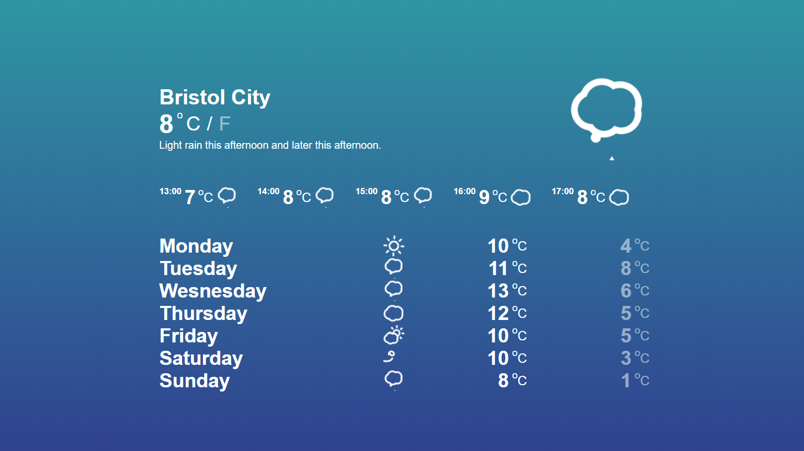

# Local-Weather-App

I built an application that fetches and displays your local weather. It does this by asking for your current geo-code location through the browser and AJAX to  call a 3rd party API (Dark Sky API) to fetch your local weather data. Once the data has been sent the browser will render it, including the current weather and future forecast. I did this using Javascript, CSS and HTML. It is also fully responsive and will adjust to screen size via media query.

# Screen Shots

